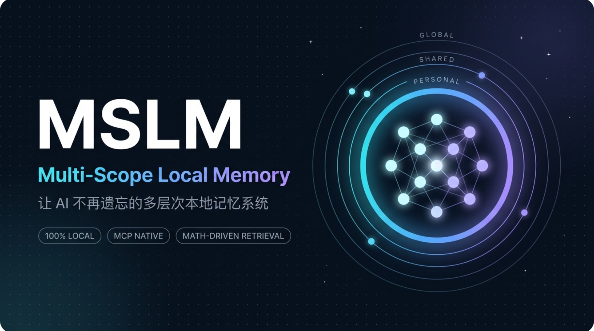

<p align="center">
  
</p>

<h1 align="center">MSLM</h1>

<p align="center"><strong>Multi-Scope Local Memory</strong><br/>
<em>The multi-scope local memory system that keeps AI from forgetting.</em></p>

<p align="center"><code>v4.2.0</code> · kernel merged from upstream SuperLocalMemory 4.1.11<br/>
Persistent memory for Claude Code, Cursor, Hermes Agent, and any MCP-compatible AI client</p>

<p align="center">
  <a href="https://pypi.org/project/mslm-memory/"></a>
  <a href="https://www.npmjs.com/package/mslm-memory"></a>
  <a href="LICENSE"></a>
</p>

<p align="center">📖 <strong>Docs</strong>: <a href="README.md">中文</a> · <strong>English (this page)</strong> · <a href="docs/INDEX-en.md">Docs index</a> · <a href="docs/hermes-agent-guide-en.md">Hermes guide</a> · <a href="CHANGELOG.md">Changelog</a></p>

<p align="center"><code>Three-Tier Scope</code> &nbsp;·&nbsp; <code>Fully Local</code> &nbsp;·&nbsp; <code>MCP Native</code> &nbsp;·&nbsp; <code>Math-Driven Retrieval</code></p>

---

MSLM (Multi-Scope Local Memory) is a local-first, multi-scope memory system for AI agents, built on the [SuperLocalMemory](https://github.com/qualixar/superlocalmemory) engine. No Docker, no graph database, no API key.

## Why MSLM?

Every hosted AI memory platform sends your data to cloud LLMs by default — and with the EU AI Act in force since August 2026, those cloud paths face growing compliance pressure.

MSLM takes a fundamentally different approach: **mathematics instead of cloud compute.** Techniques from differential geometry, algebraic topology, and stochastic analysis — inherited from the SuperLocalMemory engine — deliver high-quality local memory retrieval on plain CPU.

**MSLM adds a multi-scope collaboration layer on top of the engine**: three scopes (personal / shared / global) let multiple AI agents keep independent memories while sharing team knowledge. That is the dividing line between MSLM (multi-agent collaborative memory) and upstream SuperLocalMemory (single-user memory).

## Three-Tier Scope Memory

| Scope | Visibility | Use case |
|-------|-----------|----------|
| **personal** | Current profile only | Personal preferences, private information |
| **shared** | Named agents / profiles | Team collaboration, domain sharing |
| **global** | All agents | Common knowledge, technical entities |

- Recall queries all three scopes in parallel and fuses results with weighted RRF; cross-scope reads are default-deny and must be enabled explicitly.
- **Global authoritative entities**: technical entities like React and Python are shared by all agents instead of being rebuilt per agent.
- **Per-request profile routing (new in v4.2.0)**: `remember` / `recall` / `list_recent` accept an optional `profile_id` that routes the operation to that namespace with zero global-pointer side effects; omitting it is byte-for-byte legacy behavior. The Hermes MemoryProvider pins to its configured profile by default (`SLM_HERMES_PIN_PROFILE=0` to follow the active pointer instead).

## Core Features

### 🧠 Multi-Scope Memory Architecture

- **Three scopes**: personal / shared / global for fine-grained visibility control
- **Global authoritative entities**: technical entities shared across agents, no duplication
- **Domain-tag auto-matching**: 48 built-in entity→domain mappings, shared across agents automatically

### 🔬 Math-Driven Retrieval

- **7-channel hybrid retrieval**: semantic vectors + BM25 keywords + entity graph + temporal awareness + Hopfield association + profile filtering + graph propagation
- **RRF weighted fusion**: intelligent ranking across scopes
- **Fisher-Rao information geometry** similarity · **Sheaf consistency detection** (automatic contradiction discovery) · **Langevin lifecycle** (automatic memory reinforcement/decay)

### 🧩 Hermes Agent MemoryProvider (recommended)

- **Native integration**: no MCP subprocess, zero extra latency, loaded at Hermes startup
- **Automatic context injection**: relevant memories prefetched each turn; conversation facts persisted automatically
- **Native three-scope support**: `slm_recall` / `slm_remember` / `slm_status`
- **Configure and go**: `hermes memory setup`, or one YAML block

### 🔌 Universal MCP Integration

- **stdio / HTTP dual transport**: tool surface tiered via `SLM_MCP_PROFILE` (core / full / power, …)
- **Claude Code / Cursor / Windsurf** — works with any MCP-compatible client out of the box

### 🏠 Fully Local

- **Zero cloud dependency**: all data stored in local SQLite (WAL mode)
- **Runs on CPU**: no GPU, no Docker
- **Mode A keeps memory content on your machine**

### 📊 Web Dashboard

`slm dashboard` opens a local operations view: memory network graph, entity timelines, retrieval statistics, system health checks (Fisher-Rao / Sheaf / Langevin), and maintenance actions.

---

## Quick Start

### Install

```bash
# pip (Python 3.11+, provides the slm command)
python -m pip install mslm-memory
slm setup          # Interactive setup wizard (Mode A recommended)
slm doctor         # Environment self-check

# or npm (Node 18+, additionally provides the equivalent mslm command)
npm install -g mslm-memory
mslm setup && mslm doctor
```

> MSLM is also published as `superlocalmemory` — `pip install superlocalmemory` is equivalent.

### First Use

```bash
slm remember "Alice works at Google as a Staff Engineer" --json
slm recall "What does Alice do?"
slm status
```

### Connect Hermes Agent (MemoryProvider recommended)

```bash
hermes memory setup
# Choose superlocalmemory and follow the prompts (all-local Mode A is fine)
```

Or edit `~/.hermes/config.yaml` directly:

```yaml
memory:
  provider: superlocalmemory
  superlocalmemory:
    mode: "A"             # A fully local | B local Ollama | C cloud LLM
    include_global: true  # Include facts shared across profiles in recall
```

### Connect Other MCP Clients

```json
{
  "mcpServers": {
    "mslm": { "command": "slm", "args": ["mcp"] }
  }
}
```

HTTP transport (start the daemon first with `slm serve start`): `http://127.0.0.1:8765/mcp/`

---

## Operating Modes

| Mode | Name | Description |
|------|------|-------------|
| **A** | Local Guardian | Zero cloud, zero LLM, fully local (default, recommended) |
| **B** | Smart Local | Local Ollama LLM enrichment |
| **C** | Full Power | Cloud LLM assistance (content sent to the configured provider) |

```bash
slm mode a   # Switch operating mode
```

---

## Relationship to SuperLocalMemory

MSLM is an independent distribution (fork) of [SuperLocalMemory](https://github.com/qualixar/superlocalmemory); the kernel is currently merged with upstream 4.1.11:

- **Same engine**: storage, 7-channel retrieval, and the math layers come from upstream SLM
- **MSLM adds the collaboration layer**: three scopes, global authoritative entities, cross-agent knowledge sharing, the Hermes MemoryProvider, and per-request profile routing
- **Upstream capabilities included**: SLM-Mesh, enterprise RBAC, cache/compress, and more — see the [upstream docs archive](docs/slm/INDEX.md)
- **Independent brand**: MSLM focuses on multi-agent collaboration; SLM focuses on single-user memory

---

## Documentation

| Document | Description |
|----------|-------------|
| [Getting Started](docs/getting-started-en.md) | Complete guide from install to daily use |
| [Multi-Scope Memory](docs/multi-scope-memory-en.md) | Three-scope concepts and usage |
| [Hermes Agent Integration](docs/hermes-agent-guide-en.md) | MCP protocol integration guide |
| [Configuration Guide](docs/configuration-en.md) | Modes, providers, environment variables |
| [Memory Import Guide](docs/memory-import-guide-en.md) | Bulk import from external systems |
| [Docs Index](docs/INDEX-en.md) | Full documentation index |
| [Upstream SLM Technical Docs](docs/slm/INDEX.md) | Upstream architecture and API docs |

---

## Community & License

- **Issues**: [GitHub Issues](https://github.com/kenyonxu/superlocalmemory/issues)
- **Upstream project**: [SuperLocalMemory](https://github.com/qualixar/superlocalmemory)
- **License**: AGPL-3.0-or-later (see [LICENSE](LICENSE), [ATTRIBUTION.md](ATTRIBUTION.md))

The core memory engine is provided by [SuperLocalMemory](https://github.com/qualixar/superlocalmemory) (Qualixar / Varun Pratap Bhardwaj) — with thanks.

---

*MSLM — powered by [SuperLocalMemory](https://github.com/qualixar/superlocalmemory)*
