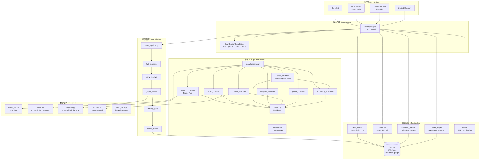
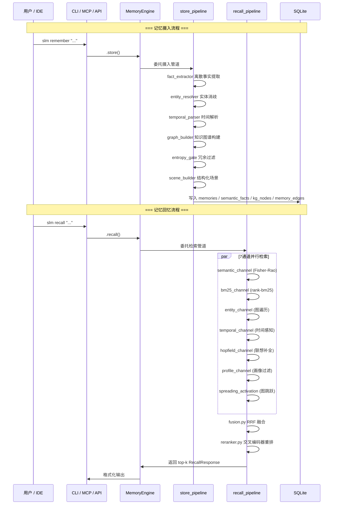

# SLM-V3 架构分析报告

> 基于 graphify 知识图谱（18,016 节点 / 50,056 边 / 832 社区）的 SuperLocalMemory V3 架构解析
> 生成时间：2026-05-07 | 源码提交：`704475be`

---

## 一、核心抽象：本地优先的 AI 记忆操作系统

SuperLocalMemory V3（SLM-V3）是一个**本地优先（local-first）**的 AI 智能体记忆系统，用 Python 编写，通过 MCP 协议和原生 CLI 为 AI 编程助手提供持久化记忆能力。其设计哲学可概括为三个核心抽象：

1. **记忆即数据（Memory as Data）**：所有记忆以 SQLite 本地存储，拒绝云 LLM 依赖
2. **多通道检索（Multi-Channel Retrieval）**：7 条并行检索通道融合，替代单一向量搜索
3. **数学驱动质量（Math-Driven Quality）**：三层数学层（Fisher-Rao、Sheaf、Langevin）作为核心检索质量机制，而非学术装饰

图谱数据支撑：18,016 个节点、50,056 条边构成 dense 的知识网络，54% 为提取边、46% 为推理边（平均置信度 0.65），832 个社区揭示出高度模块化的架构特征。

---

## 二、模块拓扑

SLM-V3 采用**薄门面 + 厚管道**的分层架构。`MemoryEngine` 是中央门面（community 0/9），自身极薄，所有工作委托给三大管道和若干子系统。

---

## 三、数据流

记忆的生命周期分为**摄入（Ingestion）**和**回忆（Recall）**两条主线，由 `engine_wiring.py`（community 43）统一编排组件初始化。

---

## 四、创新点

### 4.1 七通道检索融合（7-Channel RRF Fusion）

传统 RAG 系统依赖单一向量相似度。SLM-V3 的检索层由 7 个独立通道组成，通过 RRF（Reciprocal Rank Fusion, k=60）合并结果，再经可选的交叉编码器重排。这种设计将**语义、关键词、图结构、时间、联想、画像、传播激活**六种信号统一融合，显著优于单一向量检索。

### 4.2 数学层替代云 LLM

三层数学层是架构的核心创新：

- **Fisher-Rao 度量**：信息几何相似度评分，在困难对话中单独贡献 **+10.8 个百分点**
- **Sheaf 层**：通过上边界范数计算检测记忆矛盾
- **Langevin 动力学**：在庞加莱球上建模记忆生命周期

这些不是可选的学术插件——它们是**核心检索质量机制**，使系统在无云 LLM 时仍能维持高质量检索（Mode C）。

### 4.3 自适应学习排名（4-Stage Learning）

`learning/` 模块实现从冷启动到精调的四阶段进化：

| 阶段 | 信号数 | 机制 |
|------|--------|------|
| Baseline | 0–19 | 默认权重 |
| Rule-based | 20+ | 启发式规则 |
| ML Model | 200+ | LightGBM 训练 |
| Refinement | 持续 | 在线微调 |

信号收集器（collectors.py）追踪共现检索、置信度、通道性能、熵差等维度。

### 4.4 代码知识图谱（V3.4）

`code_graph/` 使用 tree-sitter + rustworkx 构建代码知识图谱，支持函数、类、导入关系的跨文件桥接发现，使 SLM 能够理解代码库结构并提供代码感知的记忆检索。

---

## 五、架构模式

### 5.1 门面模式（Facade）
`MemoryEngine` 是唯一的中央门面，所有子系统通过它交互。门面极薄——仅做能力门控（Capabilities enum）和委托调度。

### 5.2 管道模式（Pipeline）
存储和检索分别由 `store_pipeline` 和 `recall_pipeline` 封装，内部由独立模块组成流水线。这种设计使单元测试可以单独测试每个环节。

### 5.3 策略模式（Strategy）
`strategy.py` + `channel_registry.py` 决定每次查询激活哪些通道。系统可根据查询特征动态选择检索策略。

### 5.4 画像-模式隔离（Profile-Mode Isolation）
- **Profile**：独立记忆空间，支持多用户/多项目隔离
- **Mode A/B/C**：决定 LLM 可用性和检索质量级别（A=完整 LLM，C=无 LLM 纯本地）

### 5.5 事件驱动钩子（Event-Driven Hooks）
`hooks/` 模块提供 Claude Code 钩子集成，`code_graph/bridge/event_listeners.py` 实现 Hebbian 关联学习的事件监听。

---

## 六、关键发现（基于图谱数据）

### 6.1 社区结构揭示模块化程度
832 个社区中，616 个被展示、216 个被标记为"thin"（稀疏社区）。主要社区分布：

| 社区 | 核心文件 | 功能域 |
|------|----------|--------|
| 0/9 | `core/engine.py`, `core/config.py` | 门面与配置 |
| 1/12 | `storage/database.py` | 数据库管理 |
| 2 | `storage/models.py` | 数据模型 |
| 4 | `retrieval/engine.py` | 检索引擎 |
| 10 | `encoding/entity_resolver.py` | 实体解析 |
| 43 | `core/engine_wiring.py` | 组件编排 |
| 65 | `retrieval/spreading_activation.py` | 传播激活 |

### 6.2 God Nodes（高连接度节点）

图谱中的高连接度节点揭示架构枢纽：

- **`DatabaseManager`**（community 1/12）：存储层核心，被几乎所有模块依赖
- **`MemoryEngine`**（community 0/9）：中央门面，连接存储与检索
- **`RetrievalEngine`**（community 4）：检索层门面，聚合 7 通道
- **`EntityResolver`**（community 10）：实体消歧枢纽，连接编码与存储
- **`engine_wiring.py`**（community 43）：初始化编排中心，创建所有子系统实例

### 6.3 提取 vs 推理边比例
54% EXTRACTED / 46% INFERRED 的边比例表明代码中存在大量显式调用关系，同时 graphify 成功推理出近半的隐式依赖（如配置对象被多模块共享、数学层被检索层间接使用）。

### 6.4 测试架构的成熟度
约 2,900+ 测试通过全局 mock 策略（`conftest.py` 中的 CrossEncoderReranker 和 WorkerPool mock）将完整套件时间从 20+ 分钟压缩到 2 分钟以内，体现了工程成熟度。

---

## 七、改进建议

### 7.1 架构层面
1. **减少 DatabaseManager 的上帝节点属性**：当前 community 1 和 12 均为 DatabaseManager，可考虑按读写分离拆分，降低耦合度
2. **engine_wiring.py 的单一职责**：community 43 集中了所有组件创建逻辑（VectorStore、HopfieldChannel、ConsolidationEngine 等），随着功能扩展可能演变为"上帝文件"，建议按阶段（Phase 1-5）拆分为子模块
3. **检索通道的插件化**：7 通道目前为硬编码枚举，未来可考虑注册表模式支持第三方通道扩展

### 7.2 图谱层面
1. **社区粒度**：832 个社区中 216 个为 thin community，可能代表过度碎片化。可考虑合并微小社区（<3 节点）以减少认知负担
2. **跨社区边**：当前分析聚焦于社区内部，建议进一步分析社区间连接强度，识别潜在的循环依赖或架构腐化
3. **INFERRED 边置信度**：46% 推理边平均置信度 0.65，存在 35% 的低置信度推理，建议人工审核高影响路径

### 7.3 工程层面
1. **MCP 工具分层**：33 默认 + 42 可选工具（`SLM_MCP_ALL_TOOLS=1`）的切分逻辑可从图谱中进一步验证是否合理
2. **Mode C 完整性**：无 LLM 模式下的数学层独立性是关键卖点，建议增加图谱覆盖度确保所有核心路径在 Mode C 下均有数学层支撑

---

## 附录：图谱元数据

| 指标 | 数值 |
|------|------|
| 文件数 | 807 |
| 词数 | ~1,095,321 |
| 节点数 | 18,016 |
| 边数 | 50,056 |
| 社区数 | 832（616 展示 + 216 省略） |
| 提取边比例 | 54% |
| 推理边比例 | 46%（平均置信度 0.65） |
| 源码提交 | `704475be` |

---

*本报告由 graphify 知识图谱自动生成，结合 CLAUDE.md 架构文档与社区检测分析。*
